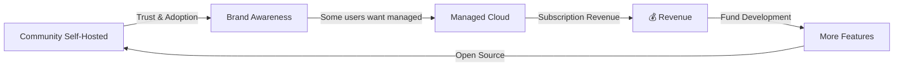

# 💎 ProjectBill — Subscription Strategy (Final)

> Model **Open-Core**: Self-Hosted = unlimited, Managed Cloud = 3 tiers

---

## 📊 Final Plan Matrix

| Resource | Starter (Free) | Pro (Rp 79k) | Business (Rp 179k) | Self-Hosted |
|----------|:-:|:-:|:-:|:-:|
| Klien | 5 | ∞ | ∞ | ∞ |
| Proyek aktif | 5 | ∞ | ∞ | ∞ |
| Invoice / bln | 15 | ∞ | ∞ | ∞ |
| Email / bln | 30 | 500 | 2.000 | ∞ |
| Payment link / bln | 10 | ∞ | ∞ | ∞ |
| Recurring template | 1 | ∞ | ∞ | ∞ |
| SOW template | 2 | ∞ | ∞ | ∞ |
| PDF print | ✅ | ✅ | ✅ | ✅ |
| PDF auto-delivery | ❌ | ✅ | ✅ | ✅ |
| File storage | ❌ | 5 GB | 20 GB | ∞ |
| WhatsApp / bln | ❌ | *deferred* | *deferred* | ∞ |
| AI assist | ❌ | ✅ | ✅ | ✅ |
| Team members | 1 | 5 | 15 | ∞ |
| Advanced reporting | ❌ | ✅ | ✅ | ✅ |
| Watermark | ✅ | ❌ | ❌ | ❌ |
| Support | Community | Priority | Priority + Dedicated | Community |

---

## 🎯 Detection Mechanism

```
# .env
DEPLOYMENT_MODE=self-hosted  # default (all unlimited)
DEPLOYMENT_MODE=managed      # enables subscription gates
```

---

## 📐 Business Model



**AGPL-3.0** license already supports this model.